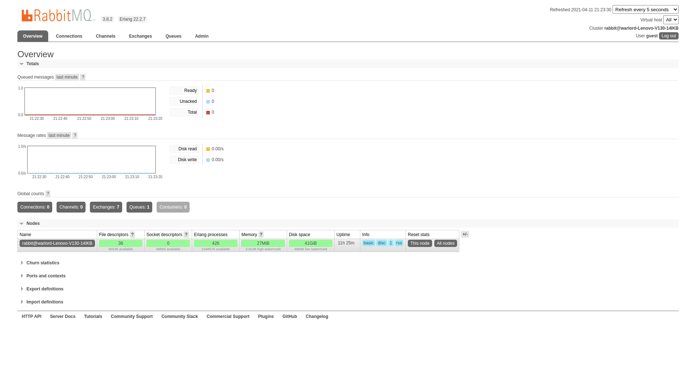
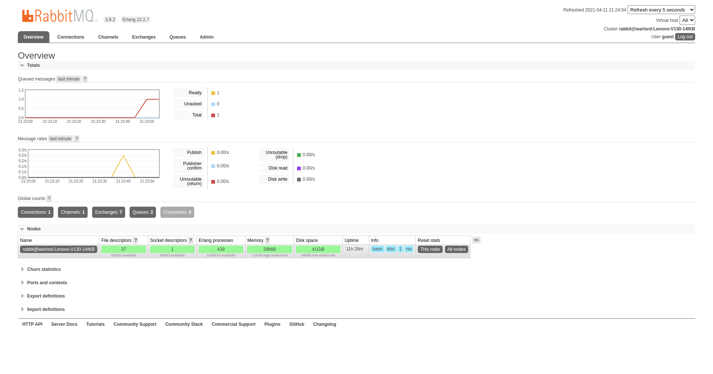
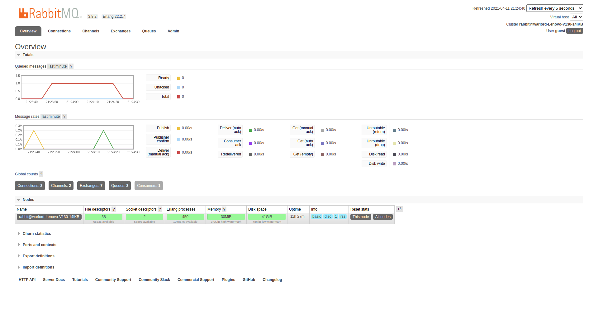

# SIMPLE_MERN_SHORT_DEMO_RABBITMQ
It's a simple example or demo project to show rabbitMQ operations
it's made by using following technologies
- ReactJS
- NodeJS
- ExpressJS
- MaterialUI
- RabbitMQ
## How To Run 
```
- RabbitMQ

    sudo apt-get update -y
    sudo apt-get install curl gnupg -y
    curl -fsSL https://github.com/rabbitmq/signing-keys/releases/download/2.0/rabbitmq-release-signing-key.asc | sudo apt-key add -
    sudo apt-get install apt-transport-https
    sudo apt-get update -y
    sudo apt-get install rabbitmq-server -y --fix-missing

    service rabbitmq-server start


    To enable RabbitMQ Management Console, run the following:
    sudo rabbitmq-plugins enable rabbitmq_management

    Once you’ve enabled the console, it can be accessed using your favourite web browser by visiting: http://[your droplet's IP]:15672/.
    The default username and password are both set “guest” for the log in.  


- Server
    1. Move To Server Directory
    cd server/

    2. Install Packages
    yarn

    3. start Server1 App to send message in queue
    nodemon src/server1.js 

    4. start Server2 App to consume message from queue
    nodemon src/server2.js 

- Client    

    1. Move To Client Directory
    cd Client/

    2. Install Packages
    yarn

    3. start Server App
    yarn start
```

## Tasks Completed

1. Homepage
2. server1 to send message to queue 
3. server2 to receive message from queue 

## Demo ScreenShots

- RabbitMQ - idle
  

- RabbitMQ - send message
  

- RabbitMQ - receive message
    